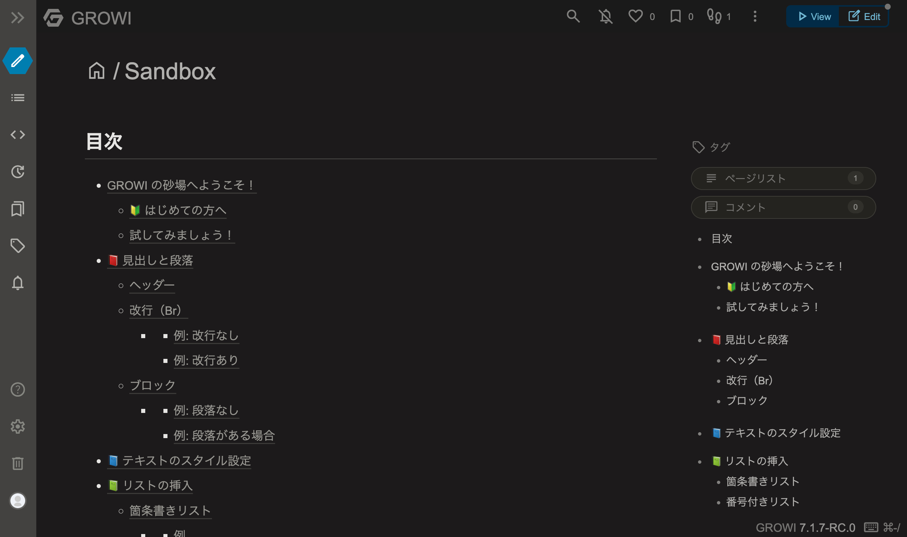

# GROIW TOC Plugin

This plugin generates table of contents in page.



## Usage

Added specific section that you want to show the table of contents. This plugin supports these label below.

```markdown
## TOC

## Table of contents

## 目次

## 目录
```

You can write it any place in the page.

## Dependency

This plugin is dependences by [remarkjs/remark\-toc](https://github.com/remarkjs/remark-toc?tab=readme-ov-file#options).

## License

MIT

